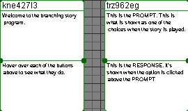

# branching-adventure
A program to handle the designing of branching stories.

It is configured in a node system so each node can be connected to each other. It allows for exporting to file either in image or in JSON to be used in another program

## Exporting
### JSON
It can be exported either as a JSON file such as that seen [here](output.json) by using the key combination shown below
### Image
It can also be exported as an image such as that shown here (there may be quality issues).

## Key Combinations
Key|Requirements|Action
---|------------|------
`c`|Two nodes selected|Connect the two selected nodes.
`d`|Two nodes selected|Disconnect the two selected nodes.
`a`|N/A|Add a new node
`Ctrl+a`|N/A|Select all nodes
`x`|One or more node selected|Delete node(s)
`h`|N/A|Show help message
`Ctrl+E`|N/A|Export the node map to an image
`Ctrl+S`|N/A|Export the node map to a JSON file or save to the current file.
`Ctrl+O`|N/A|Open JSON file
